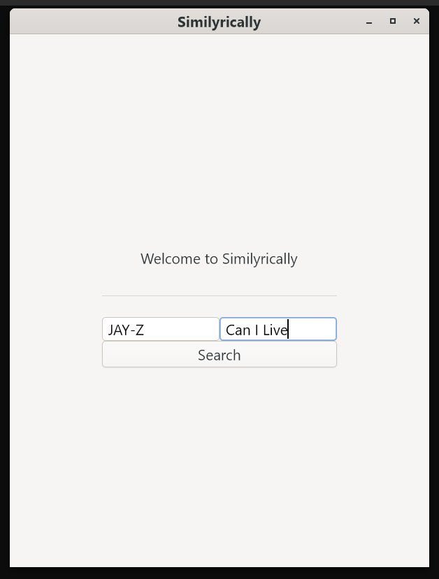
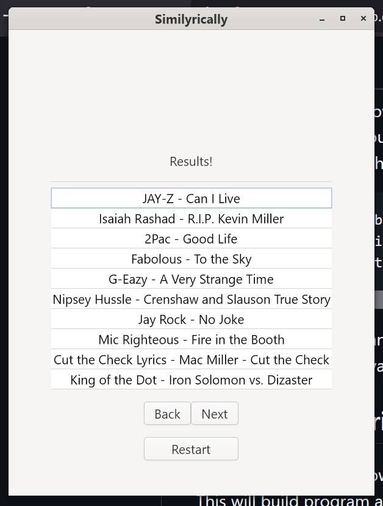

# Welcome to Similyrically!
The following steps will walk through setup, install, and using of Similyrically.


## Prerequisites
Similyrically has 2 prerequisites in order to function.
### Python and Pandas
Firstly python must be installed along with pandas. Pandas can be installed by running the following code.
```python -m pip install pandas```
### Installing Gtk
To install gtk4 for Windows 10 this zip must be downloaded. [Gtk4](https://github.com/wingtk/gvsbuild/releases/download/2024.11.1/GTK4_Gvsbuild_2024.11.1_x64.zip).
Extract this zip and copy its contents to C:\gtk\\. The folder structure should like so C:\gtk\bin.
Next, the environment variables must be set up. The following can be ran in an admin powershell.
```
$env:Path = "C:\gtk\bin;" + $env:Path
$env:LIB = "C:\gtk\lib;" + $env:LIB
$env:INCLUDE = "C:\gtk\include;C:\gtk\include\cairo;C:\gtk\include\glib-2.0;C:\gtk\include\gobject-introspection-1.0;C:\gtk\lib\glib-2.0\include;" + $env:INCLUDE
```
This is only temporary and will need to be re-ran after restarting the computer. A permanent solution is changing the windows environment variables.
## Building Similyrically
To build Similyrically, download and extract the repository. MinGW and cmake are necessary to build the program. Then go into the build/ folder and run the build.bat file. This will build the program. Click on Similyrically.exe to run the program.
Due to file size limitations, the database must be externally downloaded from this [link](https://drive.google.com/file/d/1qno3_FT3GS-21PjkKXUsVefH9TKOCNqf/view?usp=sharing). This should be copied to the build/ directory. 
# Using Similyrically
Using Similyrically is very simple. Simply input the artist name and song title into the program and hit search!
The artist name and song title are case sensitive, so if you are unsure about proper spelling and capitalization we recommend visiting the song's [Genius page](https://genius.com/) for a reference.
*Warning!* Similyrically is searching a very large database! As such it will take some time to process your request. So be patient!
# Similyrically Photos


